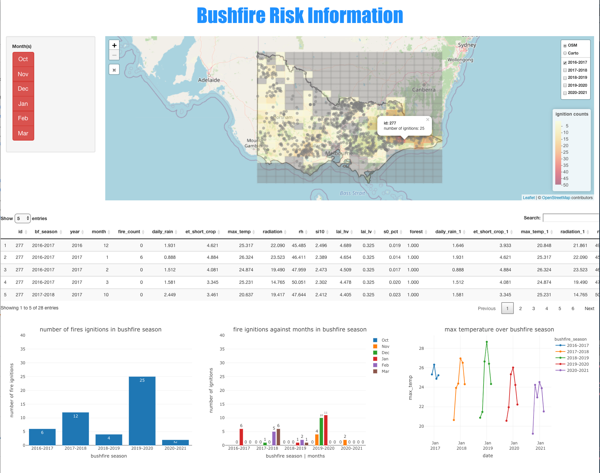
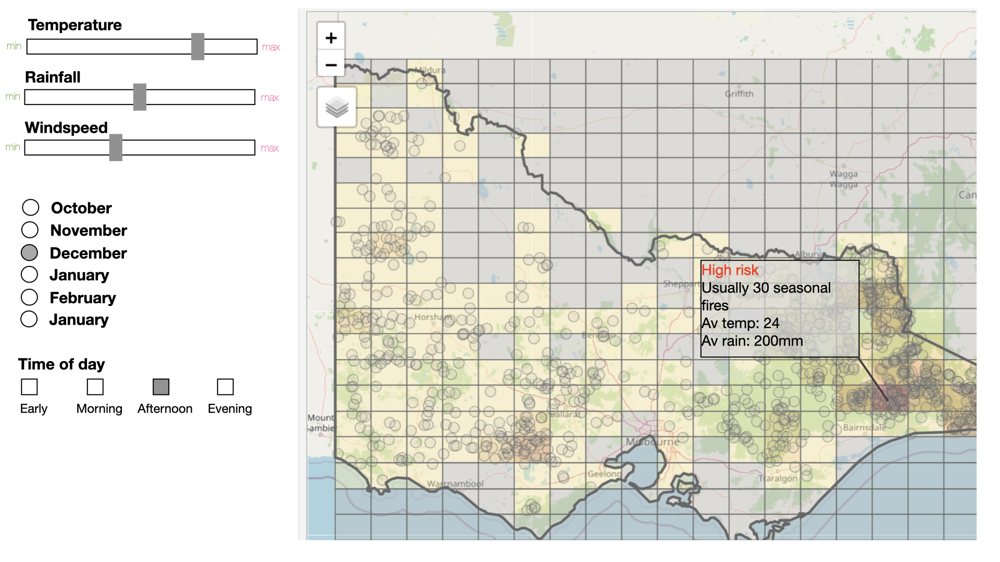

```{r setup, include=FALSE}
# --- load libraries
library(tidyverse)
library(patchwork)
library(tmap)
library(knitr)
library(kableExtra)
library(tidymodels)
library(GGally)
library(ranger)
library(kableExtra)
library(tuneRanger)
library(lime)
library(raster)
library(gridExtra)
library(tmap)
library(lubridate)
```

```{r}
# --- load relevant variables 
load(here::here("data/eda_report.RData"))
load(here::here("data/ida_report.RData"))
load(here::here("data/report_data.RData"))
```

# Introduction and Motivation

Bushfires is a common and natural phenomemon that occurs frequently in many places around the world. Melbourne Victoria however, is one of the most fire-prone regions in the world- given its fire conducive weather and fuel conditions. It is an intrinsic and inevitable part of Australia’s environment [@geoscience]. Survey studies by ANU shown that about 80% affects Australians in some way whether through direct damage or indirectly through anxiety or smoke (@aus-bf-imp). 

There have been some catastrophic bushfire events in the past including Black Saturday 2009 in Victoria, Ash Wednesday 1983 in Victoria and South Australia, the 2006 December bushfires, as well as the recent 2019-2020 bushfires. Canada, USA, Turkey, Greece, Italy and Russia faced a devastating bushfire season in the summer of 2021 since it was the hottest July ever recorded, raising concern for Australia since it is moving into summer. Especially since the 2019-2020 bushfire in Australia resulted to more damages on property and the environment compared to other bushfire events in history, with 3094 houses destroyed and over 17M hectares of land burned [@bushfire1]. 

Even though bushfires cannot be avoided naturally, their consequences can be minimised. Thus, it is important to predict the risk of bushfire as understanding the risk of fire of certain areas would help in developing strategies for mitigating the risks. A prediction model can tell us whether an area has a high risk of bushfire, and we can focus on areas with high fire risk. We will use certain modeling methods to come up with the most suitable model for predicting the bushfire risk. 

This work will focus on Victoria. Victoria is one of the most fire-prone region in the world, given its fire conducive weather and fuel conditions. This report condenses the research work on bushfire risk modelling done by Brenwin Ang and Helen Evangelina as part of their internship for ETC5543 Business Analytics Creative Activity coursework. This is an extension to the work done by Di Cook, Emily Dodwell and Patrick Li on hotspot clustering algorithm. It is based on Patrick Li’s thesis titled “Using Remote Sensing Data to Understand Fire Ignitions in Victoria during the 2019-2020 Australian Bushfire Season” [@patricksthesis]. Weather is considered a determinant for forest fires. Therefore, environmental variables such as temperature, relative humidity, wind speed, radiation, drought index, etc are used in the modelling as predictors. 

Generally, fire risk is defined as the likelihood of a fire occurring, multiplied by the severity of the fire [@merton]. In the case of this report, fire risk is defined as likelihood of fire ignition occurring. The overall objective of this work is to develop a web app by using shiny to monitor potential fire ignitions by developing fire risk models for the 2021-2022 Victorian bushfire season based on environmental variables in where users would be able to input the values of the environmental variables which would change the risk predictions. The resulting app seeks to improve accessibility to bushfire information, raise awareness to bushfires and provide data information to make informed decisions to better adapt to the many impacts of climate change. The github repository including Patrick’s thesis can be found [here](https://github.com/numbats/bushyr).


# Data Sources and Integration

Following data analysis is based off the map of Victoria that is divided into 20x20 cells (shown above). Each cell is roughly $0.451° \times 0.257°$ (or $50km \times 28km$). Note that only cells within Victoria were considered. The partitioning the study area into equally-sized marked grid cells greatly facilitates the analysis- allows comparisons between cells, point-based fire ignitions to be viewed not just as individual points but as a spatially varying density throughout the study area. The cell cize can be determined through exploratory data analysis (@cardille2001occurrence). From (other) gridded data or vector data, it also allows numeric and categorical variables to be co-registered to each cell.  A coarse grid cell was deemed adequate to spread out the spatial variation or likelihood of fire ignitions while conserving landscape-level attributes.

Our study also only focuses on bushfire seasons of October through to March given that most fire occur during these period. Data dates from 2016 to 2021. The period of data used presents a trade-off: the data must be long enough to capture the temporal variability but not too long that it ignores the changes in the data such as climate change or human-induced spatial ignition patterns. (@burn_p3)

## Fire Ignitions Data

```{r ignition-pts, fig.cap="fire ignitions represented as points on Victoria map", eval=FALSE}
# from eda's `cluster_map_facet_bf_season`
cluster_map_bf_season <- ignition_rasterize_cluster_bf_season %>% 
  mutate(fire_count = case_when(
    fire_count == 0 ~ NA_real_,
    TRUE ~ fire_count)) %>% 
  filter(bf_season == "2019-2020") %>% 
  tmap::tm_shape(name = "cell fire ignition count") +
  tmap::tm_polygons(col = "fire_count",
                    id = "id",
                    style = "fixed",
                    breaks = c(0, 10, 20, 30, 40, 50),
                    palette = "YlOrRd",
                    alpha = 0.4,
                    colourNA = "grey",
                    legend.show = F) + 
  
  # --- add ignition points (to buffer as necessary)
  tmap::tm_shape(cluster_16_21_sf %>% filter(bf_season == "2019-2020"),
                 name = "fire ignition points") +
  tmap::tm_bubbles(# col = "cause",
                   size = 0.3,
                   alpha = 0.1,
                   id = "") +
  
  # --- vic_map_sf (draw outline of Victoria )
  tmap::tm_shape(vic_map_sf,
                 name = "Victoria map outline") +
  tmap::tm_borders(lwd = 3) + # border line width 
  
  # --- themes
  tmap::tm_layout(legend.show = F) +
  tm_basemap(leaflet::providers$OpenStreetMap) +
  tmap::tm_layout(main.title = "number of bushfire ignitions across Victoria")

cluster_map_bf_season
```

As mentioned above, Fire ignitions are represented as spatial points on the map as shown in \@ref(fig:ignition-pts). Note that those are marked grid cells (associated with covariables values as well)

There were two sources of bushfire ignitions data. Firstly, satellite hotspot data from Himawari-8 satellite taken from the [Japan Aerospace Exporation Agency FTP site](https://www.eorc.jaxa.jp/ptree/faq.html). Himawari-8 data is a remote sensing data collected by remote sensors carried by a satellite. Upside of this data is that it provides a high temporal and spatial resolution. It is able to capture bushfires starting from remote areas very difficult to access by foot. It has a 10-minute time resolution. Fire ignitions were detected in real-time using a clustering algorithm. (more information on how this is done can be found in [Patrick's thesis on github](https://github.com/TengMCing/bushfire-paper)). 

Secondly, historical First Responder's data, this can be thought of as fires reported upon sight. That is, based on where the First Responder saw the fire. This is sourced from the Department of Environment, Land, Water and Planning (DELWP). Most of these were reports from volunteers manning fire toweres erected around Victoria. (See appendix for map of fire towers around Victoria)


## Climate and Landscape Variables
```{r var-tab}
tibble::tribble(~data_source, ~variables, ~format, ~temporal_resolution, ~spatial_resolution,
                "SILO (https://www.longpaddock.qld.gov.au/silo/)", "max_temp, rh, radiation, et_short_crop, daily_rain", "NetCDF", "daily", "0.05° x 0.05°",
                
                "ERA5 Reanalysis data (https://cds.climate.copernicus.eu/cdsapp#!/dataset/reanalysis-era5-single-levels-monthly-means?tab=overview)", "lai_hv, lai_lv, WS10", "NetCDF" ,"monthly", "0.25° x 0.25°",
                
                "BoM's AWRA-L (http://www.bom.gov.au/water/landscape/#/sm/Actual/month/-26.32/132.54/3/Point/Separate/-15.6/130.25/2021/4/30/)", "s0_pct", "NetCDF", "monthly", "0.05° x 0.05°",
                
                "Department of Environment, Land, Water and Planning (DELWP) (https://discover.data.vic.gov.au/dataset/forest-types-of-victoria)", "vic_forest", "ShapeFile", "Periodic", "vector data") %>% 
  knitr::kable(caption = "data source, variables, format and temporal resolution used in this study") %>% 
  kableExtra::kable_styling(bootstrap_options = c("striped", "hover"))
```

For a bushfire to ignite, it needs an ignition source and conducive weather conditions. Fire ignitions can be classified into 4 categories- lightning, arson, accident and planned burning off (back burning which escaped containment line). Previous analysis suggests more than 80% of fires can be attributed to lightning. (@the-conv) 
> Studies have demonstrated empircally a relationship between fire ignitions and weather & landscape conditions.

In this analysis, 11 covariates are considered to identify their effect on bushfire ignitions. These variables are: maximum temperature (`max_temp`) ($°C$), relative humidity (`rh`) ($\%$), solar radiation (`radiation`) ($MJ/m^2$), derived FAO56 short crop evapotranspiration rate (`et_short_crop`) ($mm$), daily rainfall (`daily_rain`) ($mm$), leaf area index in high vegetation in $m^2 \ m^{-2}$ (`lai_hv`) ($m^2 \ m^{-2}$), leaf area index in low vegetation (`lai_lv`) ($m^2 \ m^{-2}$), 10m wind speed (`WS10`) ($m\ s^{-1}$)  and  forest type in Victoria (`vic_forest`). These variables are presented in Table \@ref(tab:var-tab) above. *More information regarding the data sources can be found in the Appendix.

A subset of these variables namely `max_temp`, `rh`, `WS10` and `et_short_crop` (proxy for meteorological drought index) are used in McArthur Forest Fire Danger Index (FFDI), which is used widely across Australia to measure the degree of danger of fire in Australian forests. [REF](https://www.bushfirecrc.com/sites/default/files/managed/resource/ctr_010_0.pdf). A plethora of studies have investigated the causes of widespread bushfires. However, to date, most of the existing literature focuses mainly on bushfire spread rather than ignitions. 

As seen in the table, many of these data sources provide too fine a spatial grid resolution than required for our structure. Therefore, these are regridded to match the $20 \times 20$ gridded Victoria map above. For numeric variables (all except `vic_forest`), the values of the finer cells within our larger cells are averaged. Categorical variable (`vic_forest`) are encoded into indicator variables, for example, any grid cell containing a forest is set to a value of 1, and 0 otherwise.    

Few studies have shown that not just current conditions but ongoing conditions such as heatwaves or drought creates favourable for bushfire ignitions (@causes_abf). As such, 2 months lag of each of the variable (except `vic_forest`) was included in the modelling. 

In the process, we automated the process of extracting the variables from the various sources.


## Processing Himawari-8 hotspot data

The hotspot data from Himawari-8 firstly needs to be selected to those within the boundary of Victoria. To reduce noise, it is then filtered based on the fire power with a recommended threshold of over 100 (irradiance over 100 watts per square metre) (Williamson, 2020). 

The hotspot data from Himawari-8 needs to be grouped into clusters because some hotspots are branches of an existing bushfire. Therefore, we use spatio-temporal clustering to group the hotspots into clusters. Clustering algorithm used in this project is based on Weihao Li’s thesis (citation & reference), inspired by two existing clustering algorithm, Density Based Spatial Clustering of Applications with Noise (DBSCAN) (Ester et al., 1996) and Fire Spread Reconstruction (FSR) (Loboda and Csiszar, 2007). 

The issue with using DBSCAN for clustering hotspot data is its algorithm assumes the clustering rules work in both directions of a timeline, which does not capture the reality that bushfires evolve over time in one direction. It is not suitable for temporal data. FSR reconstructs bushfire spread well, however it is constructing the clusters sequentially. This means that FSR will consider two fires to be a single fire if they commence at different locations but they overlap. Because of this, FSR does not reflect the real speed of bushfire correctly. Other limitation of FSR is that it lacks detailed consideration of parameter tuning. Weihao Li’s clustering algorithm is inspired by these two algorithms, and it can efficiently and robustly cluster hotspot to consider the temporal behavior of bushfires.

There are four steps in the clustering algorithm. The first step is to slice the temporal dimension based on a parameter named ActiveTime. Next, the hotspots are clustered spatially by using a parameter called AjdDist, which reflects the potential distance a fire can spread with respect to the temporal resolution of the data. Hotspots in the same component will be assigned a unique membership id. The third step is to broadcast the clustering results and update the membership label. Lastly, the ignition locations are computed with the earliest observed hotspot indicates the ignition point. If there are several earliest hotspots, the centroid of these points is used. 

The clustering algorithm slices the data by its temporal dimension and splits the spatio-temporal clustering tasks into thousands spatial clustering tasks. The result of the clustering is a dataset consisting of four variables – unique identifier, longitude, latitude, and time. The final hotspot data used for this project consists of 2,917 observations from 2016 to 2021. 


# Model Building

To prevent overlaps of fire ignitions, only one of the historical or satellite fire ignition data needs to be chosen. As aforementioned, satellite data might provide more accurate locations of bushfire ignitions especially in remote areas difficult to monitor or access. There are 2 limitation hypothesis that presents itself using the historical data. Firstly, it is difficult to distinguish the number of fires one observe with the naked eye. For the same reaon, it is less accurate and more subjective to gauge the location of a fire as compared to satellite technology. Equally important is the issues regarding the consistency of fire tower manning at each station. Therefore, the satellite ignition data is used. The clustering of the hotspots are filtered to only include the bigger fires. 


## Random Forest Model

Random forest [@rf] is a supervised learning technique that is constructing hundreds of regression trees by using ensemble learning, combined to a robust prediction model. It consists of a large number of decision trees, which are combined by taking the mean of the predicted y values as the prediction of all trees. A random forest model is built from a bootstrap sample of the data. Each tree at each parent node is constructed from p randomly selected predictors [@rf2]. The trees run in parallel without any interactions amongst them [@rf-regression]. Random forest is well suited for non-linear relationships, which is suitable for our case as the relationship between environmental variables and the fire risk is non-linear. In this case, we are using random forest for regression problem in where the splitting in each node is based on minimising RSS.

An issue with modelling the risk of bushfire based on environmental variable is the collinearity between variables. For example, relative humidity changes when temperature changes. An evidence of multicollinearity in our data can be seen in \@ref(fig:collinearity). Random forest model can handle multicollinearity problem well as it offers protection against the impact of collinearity between predictors [@rf2]. The reason for this is because random forest only considers a subset of predictors at each split, resulting to decorrelated trees. Even though multicollinearity is not a problem for the random forest algorithm itself, it might be a problem for the variable importance. Feature importance might be affected by multicollinearity as the importance of variables with high collinearity will be offset by each other. 

```{r collinearity, fig.cap= "The figure shows the correlation matrix of the variables in our data. There are some variables in our data with high correlations, such as radiation has a really high correlation with et_short_crop (0.9)." }
data_corr <- train %>%
  ungroup() %>%
  dplyr::select(-id, -year) 
ggcorr(data_corr, label = T)
```

Based on our previous analysis, month is an important variable in determining the risk of fire as the risk of bushfire differs monthly. We treated month as a factor variable in our model. We fitted a random forest model with all the variables in our dataset as the explanatory variables. Our first random forest model is a model fitted using `ranger` [@ranger] without specifying the number of trees (ntree) and the number of variables used in each tree (mtry). The result is a random forest model by using 500 ntree and 5 mtry. This model has a mean of squared residuals of 1.216 and R-squared of 0.396. Test MSE resulted from this model is 2.379 with an R-squared of 0.23, indicating that random forest is better than a linear regression model. Summary statistics of the test set on the random forest model is on \@ref(tab:test-summary).

```{r}
train_final <- train %>% 
  left_join(lonlat, by = "id") %>%
  dplyr::select(-year) %>% mutate(month = as.factor(month))

set.seed(2021)
randomforest1 <- ranger(fire_count ~ .-id, data = train_final, importance = "impurity")
```

```{r}
# Function for evaluating model
model_summary <- function(truth, estimate){
  
  df_new <- data.frame(truth = truth,
                       estimate = estimate)
  
  data.frame(RMSE = rmse_vec(truth, estimate),
             MAE = mae_vec(truth, estimate),
             "R-Square" = rsq_vec(truth, estimate),
             check.names = F
             ) %>% 
   mutate(MSE = mean((truth - estimate)^2))
}
```

```{r}
predictions <- randomforest1$predictions
predicted_data <- train %>% bind_cols(predictions = predictions)
kable(model_summary(truth = train$fire_count,
           estimate = predictions))

mean((predicted_data$fire_count - predicted_data$predictions)^2)
```


```{r test-summary, fig.cap="Summary statistics of the random forest model on test set."}
test2 <- test %>%
  left_join(lonlat, by = "id") %>%
  dplyr::select(-id, -year) %>%
  mutate(month = as.factor(month))

predicted <- predict(randomforest1, test2)$predictions

kable(model_summary(truth = test2$fire_count,
           estimate = predicted))
```

### Features Selection

We explored if only including the important variables would make the model better. As stated before, the variable importance on a random forest with multicollinearity in the data could not really be trusted. Therefore, we used `lime` [@lime] to understand which variables contribute most to the prediction of bushfire risk. Local Interpretable Model-agnostic Explanation (LIME) can explain the predictions of a regression problem in an interpretable manner, which is done by learning an interpretable model locally around the prediction [@black-box]. We split our data into data with high fire counts and data with low fire counts. Then, we sampled 4 observations from each data,  which will be passed to the `explain` function. 


```{r}
set.seed(2021)
train2 <- train_final %>% dplyr::select(-fire_count)

explainer <- lime(x = train2,
                  model = randomforest1) 

# dealing with model_type error
model_type.randomForest <- function(x){
  return("regression") # for regression problem
}

predict_model.randomForest <- function(x, newdata, type = "response") {

    # return prediction value
    predict(x, newdata) %>% as.data.frame()
    
}

# sampling data
data_low <- train_final %>% filter(fire_count < 5)
data_high <- train_final %>% filter(fire_count>5)

set.seed(2021)
lime_sample1 <- sample(1:length(data_low),4)
lime_sample2 <- sample(1:length(data_high),4)

data_selected1 <- data_low[lime_sample1, ]
data_selected2 <- data_high[lime_sample2, ]
data_selected <- data_selected1 %>% bind_rows(data_selected2) %>%
  dplyr::select(-fire_count)

# creating explanation
explanation <- explain(x = data_selected,
                       explainer = explainer, 
                       feature_select = "auto",
                       n_features = 15)

explanation1 <- explanation %>% filter(case %in% c(1,2,3,4)) 
explanation2 <- explanation %>% filter(case %in% c(5,6,7,8)) 
```

```{r plot-features, fig.cap= "The figure illustrates the variables which are deemed as important in predicting the fir risk for the low fire counts."}
plot_features(explanation1)
```

```{r plot-features2, fig.cap= "The figure illustrates the variables which are deemed as important in predicting the fir risk for the high fire counts."}
plot_features(explanation2)
```

Figure \@ref(fig:plot-features) illustrates the predictors which explain most of the fire risk prediction for the low fire counts with the x-axis showing the relative magnitude and direction of each predictors. While figure \@ref(fig:importance-rf2) shows those for the high fire counts. It can be seen that forest and month are really important in both cases, followed by surface soil moisture (s0_pct), wind speed (si10), and radiation. The top 15 features  are mostly the same for all the observations. We used these important features to fit a random forest model, however this new model has a higher mean of squared residuals. Hence, we decided to proceed with the random forest model with all of the variables. 

### Parameters tuning
To increase the accuracy of our model, we did paramaters tuning by using the `tuneRanger` package [@tuneRanger] to find the best values of parameters for our model. Lowest error is achieved when mtry is equal to 8 and ntree equal to 500. We then fitted another random forest with these parameters and all of the predictors, which resulted to a 1.212 mean of squared error and R-squared of 0.399, which is slightly better than the previous model. After applying the model to the test set, we get a slightly higher MSE (2.39) and a slightly lower R-squared (0.21), indicating that the tuned model is slightly worse than the previous model. This might be due to the random forest model to overfit the training data, hence why it does not perform better on the test set. Summary statistics of the tuned model on the test set can be seen on table \@ref(tab:test-summary2) Even though the tuned model performs better on the training set, it performs worse on the test set. This indicates that the tuned model might over-fit the training set, therefore we choose to go with the un-tuned model.

```{r test-summary2, fig.cap="Summary statistics of the random forest model on test set."}
set.seed(2021)
randomforest2 <- ranger(fire_count ~ .-id, data = train_final, importance = "impurity",num.threads=8,verbose=FALSE,mtry=8,min.node.size=2,num.trees=500,replace=FALSE)

predicted2 <- predict(randomforest2, test2)$predictions

kable(model_summary(truth = test2$fire_count,
           estimate = predicted2))
```

To evaluate our model more, we calculated the residuals and plotted them against the predicted values. There are some high residuals, indicating that the model is not predicting some observations well. Figure \@ref(fig:map-rf1) shows the representation of the actual monthly fire counts and predicted fire counts on the training set. One clear thing to notice here is that our model tends to under-predict the fire counts, especially in March. This is due to the many zeros in our response variable which might bring down the prediction. Figure \@ref(fig:map-rf-test) shows the comparison for the test set. The predictions for the test set do not really capture the observed fire counts, which might be due to the different situations in 2020-2021 and the different number of fires every bushfire period. 2020-2021 has a higher number of fires, especially in January and March, which needs to be further explored in future works. Our model under-predicts the fire counts. Looking at the proportions of fire instead of counts might be better because looking at the pattern on the map, our model predicts those cells with higher observed fire counts to have higher predicted fire counts compared to others.

```{r map-rf1, fig.cap = "A map of the monthly fire counts of the actual (left) vs the predicted values (right) resulted from the random forest model for the training set.", warning = FALSE, message = FALSE}
tmap_arrange(actual_oct, pred_oct,
             actual_nov, pred_nov,
             actual_dec, pred_dec,
             actual_jan, pred_jan,
             actual_feb, pred_feb,
             actual_mar, pred_mar)
```

```{r map-rf-test, fig.cap = "A map of the monthly fire counts of the actual (left) vs the predicted values (right) resulted from the random forest model for the test set.", warning = FALSE, message = FALSE}
tmap_arrange( test_actual_oct, test_pred_oct,
              test_actual_nov, test_pred_nov,
              test_actual_dec, test_pred_dec,
              test_actual_jan, test_pred_jan,
              test_actual_feb, test_pred_feb,
              test_actual_mar, test_pred_mar)
```

Another limitation of our model is that there are a lot of zeros in the data, which might result to the under-prediction of fire counts. As previously mentioned, there are some high residuals which might be due to the huge amount of zeros in the data, which might affect the predictions for those with similar weather conditions but with a high fire counts. Additionally, the random forest is using variables which represent weather conditions, which might not account for accident-based fires. We might also be missing some variables that are useful for predicting the risk of fire, like distance to road. This could be a consideration for our future work to include more variables.


## Model Alternatives

A lasso regression was attempted to parse out important variables. Depending on the penalty ($\lambda$) term imposed on the least square optimisation problem has the effect of shrinking (unimportant) variables to zero/very small coefficient. While lasso regression can be a good regularisation technique to sieve out important variables, it is inadequate for modelling in our scenario. This is mainly due to the structure of our variables. The climate variables are highly correlated as one might expect. For example, with high `daily_rain` one can expect a lower `max_temp` or a variable with its lag variables are highly correlated. These relations exist across many of our variables thus indicating high  multicollinearity

```{r}
lm_fit <- stats::lm(formula = log(fire_count + 1) ~ . -id -year -month,
                    data = model_df2)

car::vif(lm_fit) %>% 
  as_tibble(rownames = "variable") %>% 
  rename(VIF = value) %>% 
  # extract variables with highest VIF 
  slice_max(VIF, 
            n = 6) %>% 
  kable(digits = 2,
        caption = "Variables with largest Variance Inflation Factors(VIF)") %>% 
  kable_styling(bootstrap_options = c("striped", "hover", "condensed"))
```


To demonstrate, we fit a simple linear model and compute the Variance Inflation Factor (VIF). The 6 variables with the highest VIF is shown in \@ref(tab:vif-tab). A general rule of thumb is that if VIF $> 10$ then multicollinearity is high (REF)[https://www.andreaperlato.com/mlpost/deal-multicollinearity-with-lasso-regression/]. Lasso's objective function provides unstable solutions in prescence of collinear features or features with very similar information. [REF](https://www.lexjansen.com/wuss/2018/131_Final_Paper_PDF.pdf). 

Therefore, due to the inherent interplay between the variables, lasso regression is not used for modelling. For the same reason, generalised linear models(GLMs) attempted such as Poisson regression were ruled out. 


# Shiny Web application (User-Interface)

The outputs of data processing and bushfire predictions are put together in an app. This app is an extension to an previously made `RShiny` app (publicly available on [Department of Econometrics and Business Statistics, Monash University](https://ebsmonash.shinyapps.io/VICfire/). The previous app allow users to visualise bushfires in Victoria at a period of time of their choosing. Outputs are based on the clustering results. Also, a model predicts the cause of bushfire; given a bushfire ignition. Our complementary goal (as per Research grant) is to develop risk model to visualise and monitor potential fire ignitions and track fires from satellite hotspots, in real time, for 2021-2022 Victorian bushfire season.   

`RShiny` allows for elegant interactive exploratory plots and updates in real-time for swift decision making. It is also highly customisable to enhance users' interface. Furthermore, it supplies convenience function to assemble the html website in `R` and is easy to deploy. 

The current project builds on the "Fire Risk" Tab. On top of the historical bushfire information and bushfire `cause` prediction, this complementary addition serves to inform users with historical information risk and up-to-date predictions around bushfire risk. We maintained a similar design for the structure of the app- keeping separate tabs for historical information and predictions. This is to cater for different users who might be using the app. Fire personnels might be interested in the weather and landscape variables creating the conducive fire environment. While users would be interested in bushfire predictions while planning a trip for instance.   

```{r app-hist-info, fig.cap="Bushfire Risk Information tab"}

```

The current state of the historical bushfire risk Information tab is shown above. in Figure \@ref(fig:app-hist-info). User interactivity include choosing the bushfire seasons to overlay ignition points. User can also choose the months to compute number of bushfires from. Upon clicking a grid cell, the data table and plots are produced. The table provides information of the different weather and landscape variables. Plots show the historically the number of bushfires and values of each variable (max temperature in this case) which might be of interest to users. These are made downloadable for interested users. 


```{r app-pred, fig.cap="rough plan for bushfire risk map"}

```

Additionally, a rough sketch of bushfire fire risk map in the app is shown above (Figure \@ref(fig:app-pred). It incorporates the random forest model to make predictions of the bushfire risk in a particular cell in real time. Users will be able to toggle the various variables and make forecasts under different scenarios. A detail is that not all cells shown will increase the same amount but instead at a relative rate (by %) to account for the fact that different places have different weather conditions.  


# Summary


# Appendix 

## Data Sources

    SILO
[`SILO`](https://www.longpaddock.qld.gov.au/silo/) is a database of Australian climate data from 1889 to current hosted by Queensland Department of Environment and Science (DES). It provides daily metereological datasets for a range of climate variables. The datasets are constructed from observational data obtained from the Bureau of Meteorology (BoM) and other suppliers. *more information on how data is constructed [here](https://www.longpaddock.qld.gov.au/silo/about/overview/).

    ERA5 renalysis data
ERA5 is the fifth generation European Centre for Medium-Range Weather Forecasts (ECMWF) reanlysis for global climate and weather. It also supplies data from 1979 onwards for a whole range of climate and weather data. 

Reanalysis combines model data and observations across the world into a globally complete and consistent dataset using the laws of physics. *[link](https://cds.climate.copernicus.eu/cdsapp#!/dataset/reanalysis-era5-single-levels-monthly-means?tab=overview)

    Victoria forest data
Victoria forest vector data delineates Victorian forest types and its attributes referenced through a forest type code. Data can be downloaded from [dicover.data.vic.gov.au](https://discover.data.vic.gov.au/dataset/forest-types-of-victoria).


    Surface soil moisture
BoM's Australian Water Resources Landscale model provides an array of estimates depicting Austrlia's water balance including surface soil moisture, evapotranspiration among others. 

## Fire towers in Victoria
```{r}
knitr::include_graphics(here::here("data/report/fire_towers.png"))
```
[Source](https://www.firelookoutsdownunder.com/Photos/Victoria/fire_towers_and_lookouts.pdf)


# Summary and Future Work
We explored some modelling to predict the risk of bushfire in Victoria for 2021-2022 based on weather conditions. Our best model is a random forest model which incorporates various weather and climate variables. This gives a training mean squared error of 1.216 and R-squared of 0.396. However, after applying to the test set, we got a slightly lower R-squared and higher MSE. The reason for this is might be because the model tends to over-fit the training set, resulting to less accurate predictions for the test set. Additionally, there are a lot of zeros in our data which results to under-predictions. It is also important to note that the response (fire ignitions) has been erratic going from one year to another.

--this is from the previous section--
Another limitation of our model is that there are a lot of zeros in the data, which might result to the under-prediction of fire counts. As previously mentioned, there are some high residuals which might be due to the huge amount of zeros in the data, which might affect the predictions for those with similar weather conditions but with a high fire counts. Additionally, the random forest is using variables which represent weather conditions, which might not account for accident-based fires. We might also be missing some variables that are useful for predicting the risk of fire, like distance to road. This could be a consideration for our future work to include more variables, 


